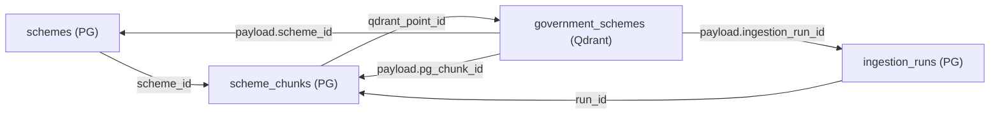

# LabhArth AI — Architecture Document

## 1. System Architecture Overview

LabhArth AI follows a **layered clean architecture** with an agentic AI core.

```
┌──────────────────────────────────────────────────────┐
│                   PRESENTATION LAYER                 │
│              React + Vite (SPA Frontend)             │
│  ┌────────┐ ┌────────┐ ┌───────────┐ ┌───────────┐  │
│  │  Home  │ │ Search │ │  Scheme   │ │   Chat    │  │
│  │  Page  │ │  Page  │ │  Details  │ │   Page    │  │
│  └────────┘ └────────┘ └───────────┘ └───────────┘  │
└───────────────────────┬──────────────────────────────┘
                        │ HTTP/REST
┌───────────────────────▼──────────────────────────────┐
│                    API LAYER (FastAPI)                │
│  ┌──────────┐ ┌────────────┐ ┌───────────────────┐   │
│  │ /health  │ │ /schemes   │ │ /chat             │   │
│  │ /eligib. │ │ /details   │ │ /eligibility      │   │
│  └──────────┘ └────────────┘ └───────────────────┘   │
│                 Dependencies & Middleware             │
│           (Auth, Rate Limiting, CORS, Logging)       │
└───────────────────────┬──────────────────────────────┘
                        │
┌───────────────────────▼──────────────────────────────┐
│                  AGENT LAYER (Google ADK)             │
│                                                      │
│  ┌──────────────────────────────────────────────┐    │
│  │           Orchestrator Agent                  │    │
│  │  Routes user intents to specialized agents    │    │
│  └──────┬────────────┬───────────────┬──────────┘    │
│         │            │               │               │
│  ┌──────▼───┐ ┌──────▼──────┐ ┌─────▼──────────┐    │
│  │ Profile  │ │   Scheme    │ │  Eligibility   │    │
│  │  Agent   │ │Search Agent │ │    Agent       │    │
│  └──────────┘ └─────────────┘ └────────────────┘    │
└───────────────────────┬──────────────────────────────┘
                        │ MCP Protocol
┌───────────────────────▼──────────────────────────────┐
│                   TOOL LAYER (MCP)                   │
│  ┌────────────────┐ ┌───────────────┐ ┌───────────┐  │
│  │ search_schemes │ │get_scheme_det.│ │check_elig.│  │
│  ├────────────────┤ ├───────────────┤ └───────────┘  │
│  │ get_profile    │ │ save_profile  │                │
│  └────────┬───────┘ └──────┬────────┘ └─────┬─────┘  │
└───────────┼────────────────┼────────────────┼────────┘
            │                │                │
┌───────────▼────────────────▼────────────────▼────────┐
│                  SERVICE LAYER                       │
│  ┌────────────────┐ ┌────────────┐ ┌──────────────┐  │
│  │ SchemeService  │ │EligService │ │ProfileService│  │
│  └────────┬───────┘ └──────┬─────┘ └──────┬───────┘  │
└───────────┼────────────────┼───────────────┼─────────┘
            │                │               │
┌───────────▼────────────────▼───────────────▼─────────┐
│                  DATA LAYER                          │
│  ┌───────────────────┐  ┌─────────────────────────┐  │
│  │  PostgreSQL (Neon) │  │    Qdrant Cloud         │  │
│  │  - Schemes         │  │    - Scheme embeddings  │  │
│  │  - Users           │  │    - Document vectors   │  │
│  │  - Sessions        │  │                         │  │
│  └───────────────────┘  └─────────────────────────┘  │
└──────────────────────────────────────────────────────┘
```

## 2. Agent Architecture

### 2.1 Orchestrator Agent
- **Role:** Entry point for all user interactions
- **Responsibilities:**
  - Intent classification (scheme search, eligibility check, profile update, general Q&A)
  - Request routing to specialized agents
  - Response aggregation and formatting
  - Conversation history management
- **ADK Type:** `Agent` with sub-agents

### 2.2 Profile Agent
- **Role:** Manages user profile and context
- **Responsibilities:**
  - Extract demographic info from conversation
  - Build and maintain user profile
  - Provide profile context to other agents
- **MCP Tools:** `get_profile`, `save_profile`
- **ADK Type:** `Agent` with MCP tools

### 2.3 Scheme Search Agent
- **Role:** Discovers relevant government schemes
- **Responsibilities:**
  - Semantic search over scheme database via RAG
  - Filter and rank results by relevance
  - Summarize scheme details and direct user to application links
- **MCP Tools:** `search_schemes`, `get_scheme_details`
- **ADK Type:** `Agent` with MCP tools

### 2.4 Eligibility Agent
- **Role:** Determines user eligibility for specific schemes
- **Responsibilities:**
  - Check user profile completeness and prompt for missing information
  - Compare user profile against scheme criteria (rule-based evaluation)
  - Perform RAG-augmented LLM reasoning to handle natural language conditions
  - Provide YES/NO with reasoning and suggest alternative or missing documents
- **MCP Tools:** `check_eligibility`
- **ADK Type:** `Agent` with MCP tools

#### Hybrid Eligibility Evaluation Workflow
The Eligibility Agent uses a three-phase hybrid approach to ensure precision, speed, and auditability:
1. **Phase 1: Profile Completeness Check**
   - The agent retrieves the user's profile and checks if it contains the necessary demographic and economic metrics required by the target scheme. If vital details are missing (e.g. income for a means-tested scheme), it requests them from the user.
2. **Phase 2: Structured Rule Matching**
   - Evaluates user profile attributes against canonical JSONB eligibility rules in PostgreSQL (e.g. `age <= 60`, `income_annual <= 200000`, `state = "Uttar Pradesh"`). This yields deterministic results for straightforward parameters.
3. **Phase 3: RAG-Augmented LLM Reasoning**
   - Retrieves unstructured eligibility chunks from Qdrant, feeding the user's profile, rule check results, and semantic chunk text to Gemini 2.5 Flash. The model reasons through complex, non-rule-encodable conditions (e.g., "must not be a government employee") and outputs the final eligibility result with natural language explanation.

---

## 3. RAG Pipeline

### 3.1 Overview
The Retrieval-Augmented Generation (RAG) pipeline enables the Scheme Search Agent and Eligibility Agent to perform semantic queries over unstructured scheme details.

```
User Query
    │
    ▼
┌──────────────────┐
│ Query Analysis   │── Extract State, Category, Intent
└────────┬─────────┘
         │
         ▼
┌──────────────────┐
│ Query Embedding  │── Gemini gemini-embedding-001 (task_type=RETRIEVAL_QUERY, 768 dim)
└────────┬─────────┘
         │
         ▼
┌──────────────────┐
│  Qdrant Search   │── Vector similarity + Payload Metadata filters
└────────┬─────────┘
         │
         ▼
┌──────────────────┐
│ Re-rank & Filter │── Deduplicate (group chunks by scheme), MMR filter (top K)
└────────┬─────────┘
         │
         ▼
┌──────────────────┐
│ Context Assembly │── Fetch full PostgreSQL metadata + format token budget
└────────┬─────────┘
         │
         ▼
┌──────────────────┐
│ LLM Generation   │── Gemini 2.5 Flash grounded response
└──────────────────┘
```

### 3.2 Retrieval & Hybrid Search
- **Embedding Model:** Gemini `gemini-embedding-001` configured to 768 dimensions.
- **Task Types:** `RETRIEVAL_DOCUMENT` used during ingestion, and `RETRIEVAL_QUERY` used for user queries to enhance matching relevance.
- **Hybrid Search:** Queries are mapped to a vector similarity search combined with hard payload filtering (e.g., restricting results to schemes matching the user's `state` or central schemes where `state` is null, and filtering by category or chunk type depending on the user's search intent).

### 3.3 Re-ranking & Context Management
- **Deduplication:** Multiple chunks belonging to the same scheme are grouped together, selecting the top chunks (e.g., `overview` + `eligibility`) and limiting the result set to a maximum of 5 unique schemes.
- **Re-ranking:** Basic re-ranking uses cosine similarity scores. An optional Maximal Marginal Relevance (MMR) filter ensures diversification of recommendations.
- **Context Window Management:** The retrieved chunks and corresponding PostgreSQL metadata are structured into a clean markdown format for LLM input, capping the total context budget at 4000 tokens to ensure high performance and prevent context dilution.

### 3.4 Ingestion Pipeline
Government scheme data ingestion is built to parse, structure, chunk, embed, and index MyScheme.gov.in data.

```
                          ┌─────────────────┐
                          │  Data Source     │
                          │ (723 Scheme PDFs│
                          │  from HuggingFace)
                          └────────┬────────┘
                                   │
                          ┌────────▼────────┐
                          │  1. LOAD        │
                          │  Parse PDF text │
                          │  into records   │
                          └────────┬────────┘
                                   │
                          ┌────────▼────────┐
                          │  2. CLEAN       │
                          │  Normalize,     │
                          │  deduplicate,   │
                          │  validate       │
                          └────────┬────────┘
                                   │
                          ┌────────▼────────┐
                          │  3. STRUCTURE   │
                          │  Parse criteria │
                          │  into JSONB     │
                          └────────┬────────┘
                                   │
                    ┌──────────────┼──────────────┐
                    │              │              │
           ┌────────▼───┐  ┌──────▼──────┐ ┌─────▼─────┐
           │ 4a. WRITE  │  │ 4b. CHUNK   │ │           │
           │ PostgreSQL │  │ by section  │ │           │
           │ (schemes)  │  │ type        │ │           │
           └────────────┘  └──────┬──────┘ │           │
                                  │        │           │
                           ┌──────▼──────┐ │           │
                           │ 4c. WRITE   │ │           │
                           │ PostgreSQL  │ │           │
                           │ (chunks)    │ │           │
                           └──────┬──────┘ │           │
                                  │        │           │
                           ┌──────▼──────┐ │           │
                           │ 5. EMBED    │ │           │
                           │ Gemini      │ │           │
                           │ gem-emb-001 │ │           │
                           └──────┬──────┘ │           │
                                  │        │           │
                           ┌──────▼──────┐ │           │
                           │ 6. UPSERT   │◄┘           │
                           │ Qdrant with │             │
                           │ deterministic│            │
                           │ point IDs   │             │
                           └──────┬──────┘             │
                                  │                    │
                           ┌──────▼──────┐             │
                           │ 7. AUDIT    │◄────────────┘
                           │ Log run in  │
                           │ ingestion_  │
                           │ runs table  │
                           └─────────────┘
```

1. **Load:** Read raw PDF documents from `shrijayan/gov_myscheme` dataset.
2. **Clean:** Normalize fields (e.g. state names, categories), validate formats, and deduplicate based on `(name, ministry, state)`.
3. **Structure:** Extract structured eligibility criteria and document arrays into canonical JSONB format.
4. **Chunk:** Split documents using section-based semantic chunking (`overview`, `eligibility`, `benefits`, `documents`, `application`, `combined`).
5. **Embed:** Generate 768-dimension vectors for chunks using Gemini `gemini-embedding-001` (task_type=`RETRIEVAL_DOCUMENT`).
6. **Upsert:** Write chunks into Qdrant using deterministic UUIDs generated via `uuid5` of `scheme_id + chunk_type + chunk_index` to make ingestion idempotent.
7. **Audit:** Record execution metadata and chunk/point stats inside the `ingestion_runs` database table.

---

## 4. MCP Integration

The Model Context Protocol (MCP) provides a standardized interface between agents and tools.

```
Agent ──► MCP Client ──► MCP Server ──► Tool Implementation
                              │
                              ├── search_schemes()
                              ├── get_scheme_details()
                              ├── check_eligibility()
                              ├── get_profile()
                              └── save_profile()
```

### Tool Specifications

| Tool | Input | Output | Source | Description |
|---|---|---|---|---|
| `search_schemes` | query, filters | List[SchemeResult] | Qdrant + PostgreSQL | Invokes RAG pipeline internally to perform vector search with metadata filters and returns ranked schemes. |
| `get_scheme_details` | scheme_id | SchemeDetail | PostgreSQL | Fetches full scheme metadata, benefits, documents, and application process from PostgreSQL. |
| `check_eligibility` | user_profile, scheme_id | EligibilityResult | Service Layer | Executes rule-based eligibility evaluation followed by RAG-augmented LLM verification. |
| `get_profile` | session_id | UserProfile | PostgreSQL | Retrieves user's saved demographic profile from PostgreSQL. |
| `save_profile` | session_id, profile_data | UserProfile | PostgreSQL | Saves or updates user's profile in PostgreSQL database. |

---

## 5. Security Architecture

| Layer | Mechanism |
|---|---|
| Transport | HTTPS (TLS 1.3) |
| API Authentication | API Key validation |
| Rate Limiting | Token bucket per IP (60 req/min) |
| Input Validation | Pydantic schemas + sanitization |
| CORS | Whitelist-based origin control |
| Secrets | Environment variables, never in code |
| LLM Safety | Gemini safety settings + prompt guardrails |

---

## 6. Data Flow

### Chat Request Flow
1. User sends message via React frontend
2. Frontend calls `POST /api/v1/chat`
3. API layer validates, authenticates, rate-limits
4. Orchestrator Agent receives message
5. Orchestrator classifies intent → routes to sub-agent
6. Sub-agent calls MCP tools as needed
7. MCP tools invoke service layer → data layer (PostgreSQL / Qdrant)
8. Response flows back through agent → API → frontend

---

## 7. Deployment Architecture

```
Railway Platform
├── Backend Service (FastAPI + Agents)
│   └── Docker Container
├── Frontend Service (Static Build)
│   └── Served via CDN/Nginx
├── PostgreSQL (Neon — External)
└── Qdrant (Qdrant Cloud — External)
```

---

## 8. Data Traceability

The system maintains tight traceability between relational database tables and the vector index to guarantee auditability and safety:



- **schemes (PostgreSQL)** stores the central structured record.
- **scheme_chunks (PostgreSQL)** maps the breakdown of a scheme into semantic sections. Each row contains the original text segment, its token count, the `ingestion_run_id`, and its corresponding `qdrant_point_id`.
- **government_schemes (Qdrant)** stores the vector representation of the chunk text. Its payload contains `scheme_id` (enabling reverse-lookup of scheme details), `pg_chunk_id` (enabling precise retrieval auditing), and `ingestion_run_id` (referencing the run that created the vector).
- **ingestion_runs (PostgreSQL)** provides an audit trail tracking when the ingestion pipeline ran, the source dataset, files parsed, and total points upserted.
