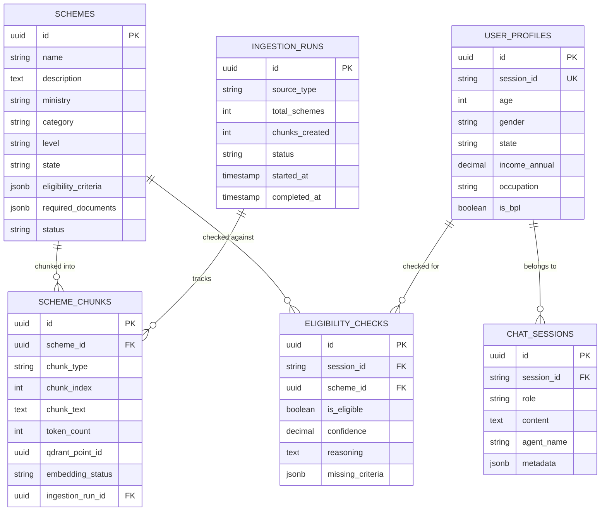

# LabhArth AI — Database Design

## 1. Overview

LabhArth AI uses a **dual-database architecture**:

| Database | Purpose | Provider |
|---|---|---|
| **PostgreSQL** | Structured data, chunk traceability, audit trails, user profiles | Neon |
| **Qdrant** | Vector embeddings for semantic search | Qdrant Cloud |

---

## 2. PostgreSQL Schema

### 2.1 `schemes` Table

Stores government welfare scheme metadata.

```sql
CREATE TABLE schemes (
    id              UUID PRIMARY KEY DEFAULT gen_random_uuid(),
    name            VARCHAR(500) NOT NULL,
    description     TEXT,
    ministry        VARCHAR(255),
    category        VARCHAR(100),          -- e.g., 'agriculture', 'education', 'health'
    level           VARCHAR(50),           -- 'central', 'state'
    state           VARCHAR(100),          -- NULL for central schemes
    eligibility_criteria JSONB,            -- structured eligibility rules (see format below)
    benefits        TEXT,
    required_documents JSONB,              -- structured array of document requirements (see format below)
    application_process TEXT,
    official_url    VARCHAR(1000),
    status          VARCHAR(50) DEFAULT 'active',  -- active, discontinued
    launched_date   DATE,
    last_updated    TIMESTAMP DEFAULT NOW(),
    created_at      TIMESTAMP DEFAULT NOW()
);

CREATE INDEX idx_schemes_category ON schemes(category);
CREATE INDEX idx_schemes_level ON schemes(level);
CREATE INDEX idx_schemes_state ON schemes(state);
CREATE INDEX idx_schemes_status ON schemes(status);
CREATE INDEX idx_schemes_eligibility ON schemes USING GIN(eligibility_criteria);
```

#### Canonical `eligibility_criteria` JSONB Format
Rules are defined as structured criteria to allow deterministic evaluation by the Eligibility Agent, with a fallback raw text property for LLM reasoning.

```json
{
    "rules": [
        {
            "field": "age",
            "operator": "lte",
            "value": 60,
            "label": "Age should be 60 years or below"
        },
        {
            "field": "income_annual",
            "operator": "lte",
            "value": 200000,
            "label": "Annual income should not exceed ₹2,0,000"
        },
        {
            "field": "state",
            "operator": "in",
            "value": ["Uttar Pradesh", "Madhya Pradesh"],
            "label": "Resident of UP or MP"
        },
        {
            "field": "is_farmer",
            "operator": "eq",
            "value": true,
            "label": "Must be a farmer"
        },
        {
            "field": "category",
            "operator": "in",
            "value": ["SC", "ST", "OBC"],
            "label": "Belongs to SC/ST/OBC category"
        }
    ],
    "additional_notes": "Institutional landholders are excluded.",
    "raw_text": "Original eligibility text from source data..."
}
```
*Supported operators: `eq`, `neq`, `gt`, `gte`, `lt`, `lte`, `in`, `not_in`, `exists`*

#### Canonical `required_documents` JSONB Format
Allows tracking of alternative/fallback documents and mandatory statuses.

```json
[
    {
        "name": "Aadhaar Card",
        "mandatory": true,
        "alternatives": ["Voter ID + Address Proof"]
    },
    {
        "name": "Income Certificate",
        "mandatory": true,
        "alternatives": ["BPL Card"]
    },
    {
        "name": "Land Ownership Certificate",
        "mandatory": false,
        "alternatives": []
    }
]
```

### 2.2 `scheme_chunks` Table

Stores section-based semantic chunks generated from each scheme, facilitating vector search traceability.

```sql
CREATE TABLE scheme_chunks (
    id                UUID PRIMARY KEY DEFAULT gen_random_uuid(),
    scheme_id         UUID NOT NULL REFERENCES schemes(id) ON DELETE CASCADE,
    chunk_type        VARCHAR(50) NOT NULL,     -- overview, eligibility, benefits, documents, application, combined
    chunk_index       INTEGER NOT NULL DEFAULT 0,
    chunk_text        TEXT NOT NULL,
    token_count       INTEGER,
    qdrant_point_id   UUID,                      -- deterministic UUID5 for Qdrant
    embedding_status  VARCHAR(20) DEFAULT 'pending',  -- pending, success, failed
    ingestion_run_id  UUID REFERENCES ingestion_runs(id),
    created_at        TIMESTAMP DEFAULT NOW(),

    CONSTRAINT uq_scheme_chunk UNIQUE(scheme_id, chunk_type, chunk_index)
);

CREATE INDEX idx_chunks_scheme ON scheme_chunks(scheme_id);
CREATE INDEX idx_chunks_type ON scheme_chunks(chunk_type);
CREATE INDEX idx_chunks_qdrant ON scheme_chunks(qdrant_point_id);
CREATE INDEX idx_chunks_status ON scheme_chunks(embedding_status);
```

### 2.3 `ingestion_runs` Table

Audits the ETL pipeline runs, tracking performance, volume, and statuses.

```sql
CREATE TABLE ingestion_runs (
    id              UUID PRIMARY KEY DEFAULT gen_random_uuid(),
    source_type     VARCHAR(100) NOT NULL,     -- csv, json, api
    source_path     VARCHAR(500),
    total_schemes   INTEGER DEFAULT 0,
    schemes_created INTEGER DEFAULT 0,
    schemes_updated INTEGER DEFAULT 0,
    schemes_skipped INTEGER DEFAULT 0,
    chunks_created  INTEGER DEFAULT 0,
    embeddings_generated INTEGER DEFAULT 0,
    qdrant_points_upserted INTEGER DEFAULT 0,
    status          VARCHAR(20) DEFAULT 'running',  -- running, completed, failed
    error_message   TEXT,
    started_at      TIMESTAMP DEFAULT NOW(),
    completed_at    TIMESTAMP
);
```

### 2.4 `user_profiles` Table

Stores profile data to match users against eligibility criteria. Note: for MVP, this table uses `session_id` as a unique key for session-scoped profiling.

```sql
CREATE TABLE user_profiles (
    id              UUID PRIMARY KEY DEFAULT gen_random_uuid(),
    session_id      VARCHAR(255) UNIQUE NOT NULL,
    age             INTEGER,
    gender          VARCHAR(20),
    state           VARCHAR(100),
    district        VARCHAR(100),
    category        VARCHAR(50),           -- general, SC, ST, OBC
    income_annual   DECIMAL(12,2),
    occupation      VARCHAR(100),
    education       VARCHAR(100),
    is_bpl          BOOLEAN DEFAULT FALSE,
    is_disabled     BOOLEAN DEFAULT FALSE,
    is_farmer       BOOLEAN DEFAULT FALSE,
    is_student      BOOLEAN DEFAULT FALSE,
    additional_info JSONB,                 -- flexible extra fields
    created_at      TIMESTAMP DEFAULT NOW(),
    updated_at      TIMESTAMP DEFAULT NOW()
);

CREATE INDEX idx_user_profiles_session ON user_profiles(session_id);
```

### 2.5 `chat_sessions` Table

Stores conversational turns to allow context retention and multi-turn flow logic.

```sql
CREATE TABLE chat_sessions (
    id              UUID PRIMARY KEY DEFAULT gen_random_uuid(),
    session_id      VARCHAR(255) NOT NULL,
    role            VARCHAR(20) NOT NULL,   -- 'user', 'assistant', 'system'
    content         TEXT NOT NULL,
    agent_name      VARCHAR(100),           -- which agent handled this
    metadata        JSONB,                  -- tool calls, tokens used, etc.
    created_at      TIMESTAMP DEFAULT NOW()
);

CREATE INDEX idx_chat_sessions_session ON chat_sessions(session_id);
CREATE INDEX idx_chat_sessions_created ON chat_sessions(created_at);
```

### 2.6 `eligibility_checks` Table

Tracks user eligibility evaluations for analytics, logging final output, logic audit, and confidence.

```sql
CREATE TABLE eligibility_checks (
    id              UUID PRIMARY KEY DEFAULT gen_random_uuid(),
    session_id      VARCHAR(255) NOT NULL,
    scheme_id       UUID REFERENCES schemes(id),
    is_eligible     BOOLEAN,
    confidence      DECIMAL(3,2),           -- 0.00 to 1.00
    reasoning       TEXT,
    missing_criteria JSONB,
    checked_at      TIMESTAMP DEFAULT NOW()
);

CREATE INDEX idx_eligibility_session ON eligibility_checks(session_id);
CREATE INDEX idx_eligibility_scheme ON eligibility_checks(scheme_id);
```

---

## 3. Qdrant Collections

### 3.1 `government_schemes` Collection

Vector collection designed for semantic chunk search.

```json
{
    "collection_name": "government_schemes",
    "vectors": {
        "size": 768,
        "distance": "Cosine"
    },
    "payload_schema": {
        "scheme_id": "uuid",
        "pg_chunk_id": "uuid",
        "scheme_name": "keyword",
        "category": "keyword",
        "level": "keyword",
        "state": "keyword",
        "chunk_type": "keyword",
        "chunk_index": "integer",
        "chunk_text": "text",
        "ministry": "keyword",
        "ingestion_run_id": "uuid",
        "ingested_at": "datetime"
    }
}
```

#### Point ID Generation Strategy
To make pipeline runs idempotent and avoid duplicate vectors on re-indexing, Qdrant point IDs (UUIDs) are generated deterministically using standard UUIDv5:

```python
import uuid

# Namespace defined for the platform
NAMESPACE_LABHARTH = uuid.UUID("3c7b2e3d-d19a-4f51-b0db-6a7f85e493cc")

# Generate deterministic UUID
point_id = uuid.uuid5(
    NAMESPACE_LABHARTH,
    f"{scheme_id}:{chunk_type}:{chunk_index}"
)
```

#### Payload Index Configurations
For high retrieval speed, payload fields used for hard filtering in searches (`state`, `category`, `level`, `chunk_type`, `scheme_id`) must have keyword index configurations.

---

## 4. Entity Relationship Diagram



---

## 5. Data Access Patterns

| Operation | Target Data Store | Query / Access Pattern | Frequency |
|---|---|---|---|
| Semantic discovery | Qdrant | Vector search filtered by `state`, `category`, and chunk_type (`overview`/`eligibility`) | High |
| Structured eligibility check | PostgreSQL | Read structured rule set in `schemes.eligibility_criteria` and evaluate against `user_profiles` | High |
| RAG eligibility retrieval | Qdrant | Vector search restricted to `chunk_type="eligibility"` and matching `scheme_id` | Medium |
| Get scheme detail | PostgreSQL | Fetch row by ID from `schemes` table | High |
| List schemes | PostgreSQL | Select schemes by category/level with pagination | Medium |
| Update profile context | PostgreSQL | Upsert `user_profiles` on match session | High |
| Log dialogue history | PostgreSQL | Insert conversational records into `chat_sessions` | High |
| Audit retrieval paths | PostgreSQL + Qdrant | Cross-reference `scheme_chunks.qdrant_point_id` or `payload.pg_chunk_id` | Low (debug) |
